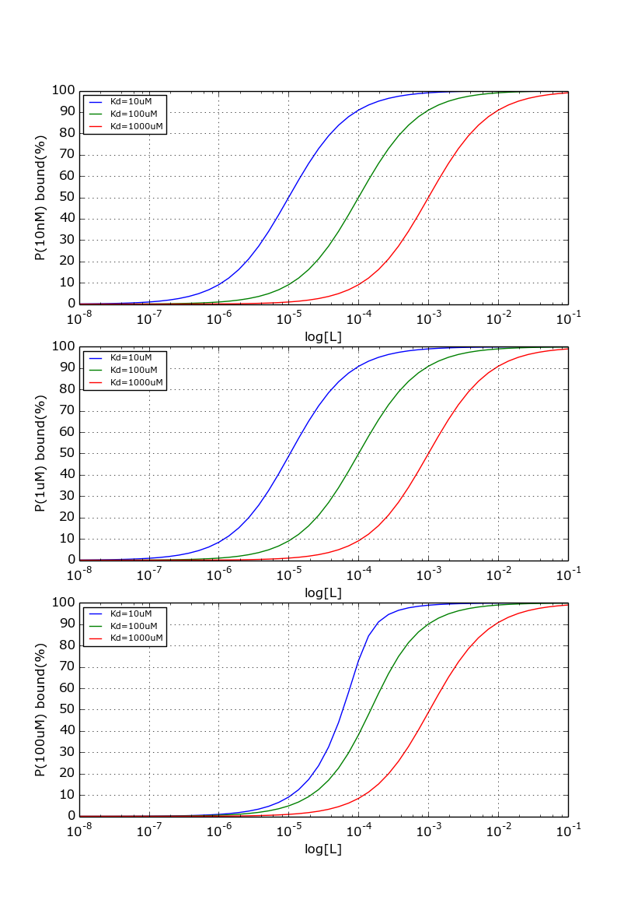
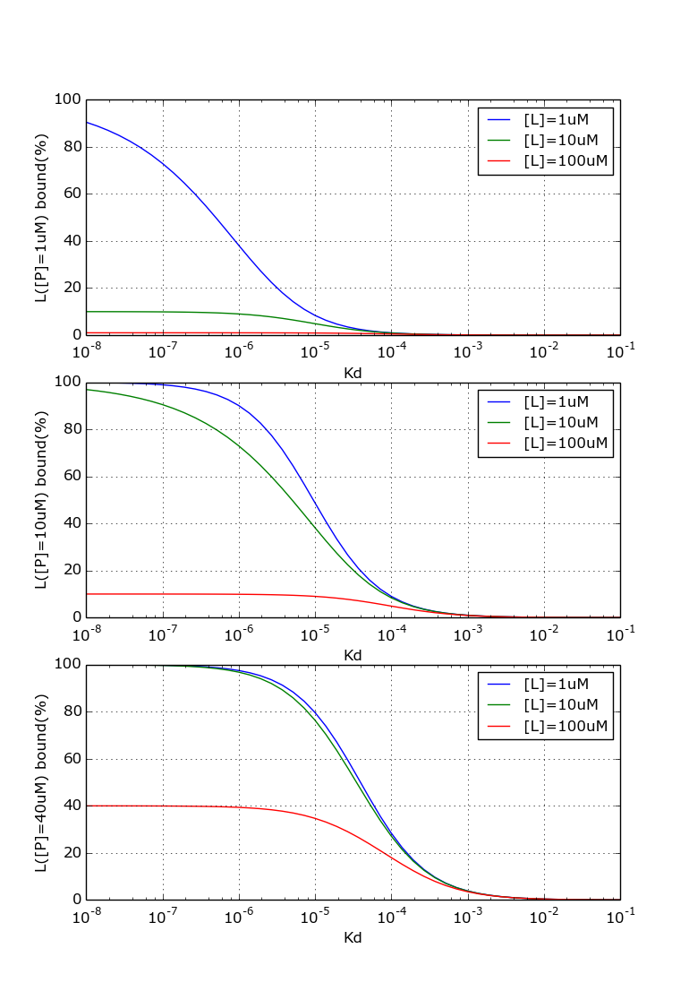
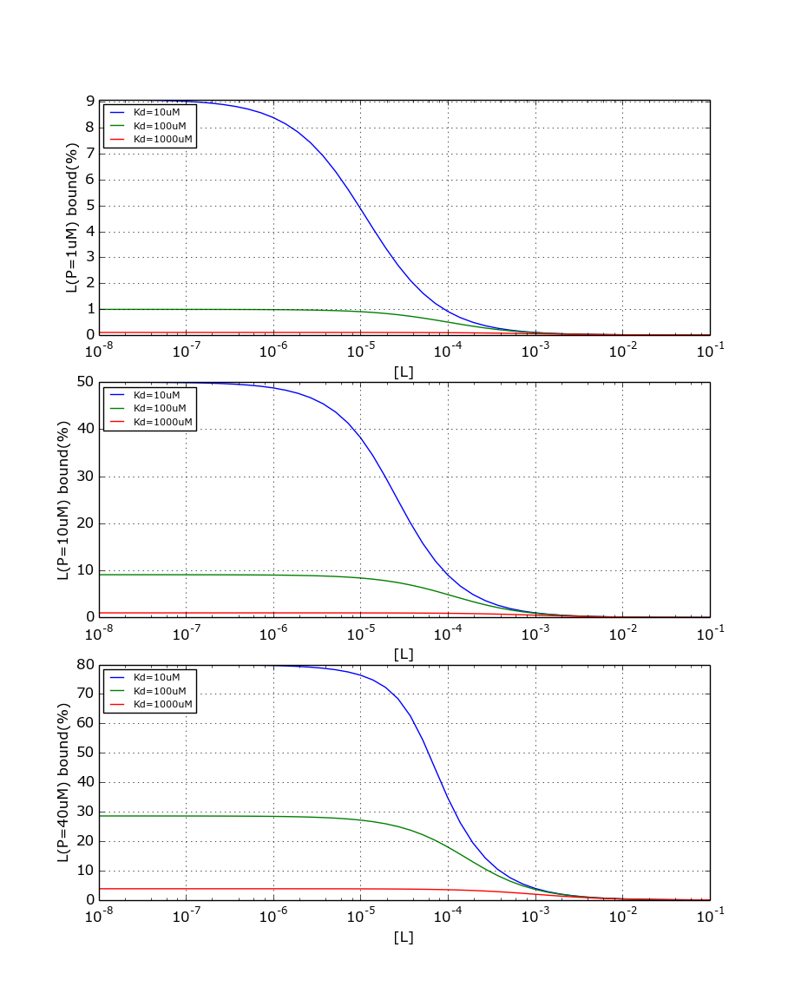

# bindingPlot
Simple two state binding plot as function of Kd, [P], and  [L]

P + L = PL, Kd=[PL]/([P][L])

### Protein observed binding ([L] on x-axis)

### Ligand observed binding (Kd on x-axis)

### Ligand observed binding ([L] on x-axis)

